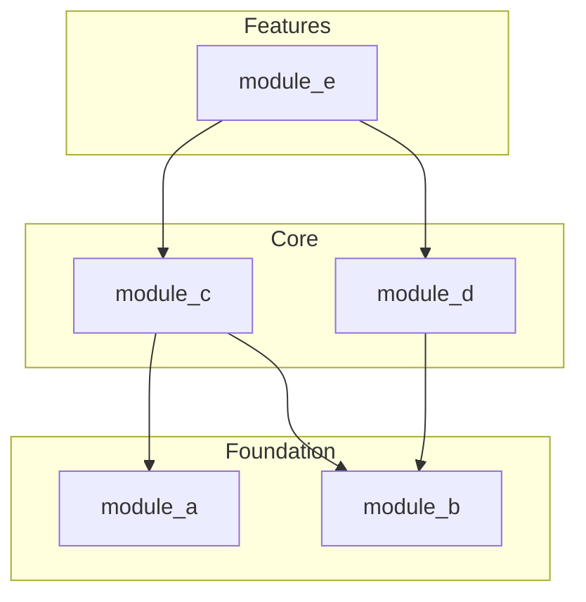

# Create Documentation from Captured Design

## Purpose

This document provides explicit instructions for generating various types of documentation from a captured design. The captured design serves as the single source of truth, and documentation is derived to serve different audiences.

## Completion Criteria

**This methodology is complete when:**
- All requested documentation types have been generated
- Documentation accurately reflects the captured design
- No methodology-internal concepts (like "tier") appear in generated documentation

## Guidance

**Tiers are methodology scaffolding, not target project architecture.**
- Do NOT include "tier" in generated documentation
- Do NOT organize docs by "Tier 0", "Tier 1", etc.
- Use domain-appropriate groupings (Foundation/Core/Features, or whatever the target project uses)
- The target project may use "tier" for entirely different purposes

**Follow target project conventions.**
- Use the language's standard doc format (rustdoc, Doxygen, docstrings, etc.)
- Match existing documentation style and structure
- Follow platform conventions (man pages, README norms, etc.)

## When to Use

- Generate human-readable design documentation
- Create developer documentation for maintainers
- Produce user/API documentation for consumers
- Generate onboarding materials
- Create architecture decision records
- Produce compliance/audit documentation

## Documentation Types

| Doc Type | Audience | Purpose | Primary Sources |
|----------|----------|---------|-----------------|
| System Design | Architects, leads | Understand system structure | design.md, modules.md |
| Developer Guide | Maintainers | Work on the codebase | design.md, decisions.md |
| API Reference | Users/consumers | Use the library/system | spec.md, design.md |
| User Guide | End users | Accomplish tasks | spec.md, examples |
| Onboarding | New team members | Get up to speed | All, curated |
| Architecture Records | Future maintainers | Understand decisions | decisions.md |
| Compliance Package | Auditors | Verify correctness | All, formatted |

## Document Organization

| Part | Sections | Description |
|------|----------|-------------|
| **I. Preparation** | §101-§103 | Select doc type, gather sources |
| **II. System Design Doc** | §201-§206 | Architecture documentation |
| **III. Developer Guide** | §301-§306 | Maintainer documentation |
| **IV. API Reference** | §401-§406 | User-facing API docs |
| **V. User Guide** | §501-§505 | Task-oriented documentation |
| **VI. Other Formats** | §601-§604 | Onboarding, ADRs, compliance |

---

# PART I: PREPARATION

---

## I.A. Documentation Planning

### I.A.1. Select Documentation Type (§101)

#### PURPOSE
Determine which documentation to generate.

#### INPUT
- User's documentation needs
- Target audience

#### ACTION
Select documentation type:

```markdown
# Documentation Request

## Selected Documentation

[ ] System Design Document — For architects and technical leads
[ ] Developer Guide — For maintainers working on the code
[ ] API Reference — For users consuming the API
[ ] User Guide — For end users accomplishing tasks
[ ] Onboarding Guide — For new team members
[ ] Architecture Decision Records — For decision audit trail
[ ] Compliance Package — For auditors/certification

## Target Audience

**Primary:** {who will read this}
**Secondary:** {other readers}

## Audience Characteristics

| Characteristic | Value |
|----------------|-------|
| Technical level | {expert | intermediate | beginner} |
| Familiarity with system | {none | some | deep} |
| Familiarity with domain | {none | some | deep} |
| Reading context | {reference | tutorial | overview} |

## Documentation Goals

- {goal 1: e.g., "Enable new dev to contribute in 1 week"}
- {goal 2: e.g., "Pass SOC2 audit"}
```

#### OUTPUT
- Documentation type selected
- Audience characterized

#### VALIDATION
```
[ ] Documentation type selected
[ ] Audience identified
[ ] Goals defined
```

#### NEXT
Proceed to §102.

---

### I.A.2. Gather Source Materials (§102)

#### PURPOSE
Identify which captured-design artifacts are needed.

#### INPUT
- Documentation type from §101
- captured-design location

#### ACTION
Map documentation type to sources:

```markdown
# Source Materials

## Required Sources by Doc Type

| Doc Type | Primary Sources | Secondary Sources |
|----------|-----------------|-------------------|
| System Design | design.md, modules.md | spec.md, decisions.md |
| Developer Guide | design.md, decisions.md | spec.md, tests.md |
| API Reference | spec.md, design.md | tests.md (examples) |
| User Guide | spec.md | tests.md (examples) |
| Onboarding | All | — |
| ADRs | decisions.md | design.md |
| Compliance | All | External requirements |

## Sources for This Documentation

**Primary:**
- [ ] {path to source 1}
- [ ] {path to source 2}

**Secondary:**
- [ ] {path to source 3}

**Additional Materials Needed:**
- [ ] {e.g., "Example code", "Diagrams"}
```

#### OUTPUT
- Source list

#### VALIDATION
```
[ ] All required sources exist
[ ] Sources are current
```

#### NEXT
Proceed to §103.

---

### I.A.3. Establish Documentation Standards (§103)

#### PURPOSE
Define formatting and style standards.

#### INPUT
- Documentation type
- Organization standards (if any)

#### ACTION
Document standards:

```markdown
# Documentation Standards

## Format

| Aspect | Standard |
|--------|----------|
| Output format | {Markdown | HTML | PDF | DocBook} |
| Heading style | {ATX # | Setext ===} |
| Code blocks | {fenced ``` | indented} |
| Diagrams | {Mermaid | PlantUML | ASCII | Images} |

## Style

| Aspect | Standard |
|--------|----------|
| Voice | {Active | Passive} |
| Person | {Second (you) | Third (the user)} |
| Tense | {Present | Future for procedures} |
| Tone | {Formal | Conversational} |

## Structure

| Element | Include? | Notes |
|---------|----------|-------|
| Table of contents | {yes/no} | |
| Version info | {yes/no} | |
| Changelog | {yes/no} | |
| Index | {yes/no} | |
| Glossary | {yes/no} | |

## Templates

{Link to or embed templates if organization has them}
```

#### OUTPUT
- Documentation standards defined

#### VALIDATION
```
[ ] Format specified
[ ] Style guidelines clear
[ ] Templates available (if needed)
```

#### NEXT
- Proceed to Part II (§201) if System Design selected
- Proceed to Part III (§301) if Developer Guide selected
- Proceed to Part IV (§401) if API Reference selected
- Proceed to Part V (§501) if User Guide selected
- Proceed to Part VI (§601) if other type selected

---

# PART II: SYSTEM DESIGN DOCUMENT

Documentation for architects and technical leads.

---

## II.A. Overview Generation

### II.A.1. Generate System Overview (§201)

#### PURPOSE
Create high-level system description.

#### INPUT
- scope.md
- modules.md

#### ACTION
Generate overview section:

```markdown
# {System Name} — System Design Document

## 1. Overview

### 1.1 Purpose

{From scope.md: What problem does this system solve?}

### 1.2 Scope

**In Scope:**
{From scope.md: What's included}

**Out of Scope:**
{From scope.md: What's excluded}

### 1.3 Key Capabilities

{List main capabilities from modules.md module purposes}

- {Capability 1}
- {Capability 2}
- {Capability 3}

### 1.4 Design Philosophy

{From decisions.md: Key design principles and trade-offs}
```

#### OUTPUT
- Overview section

#### VALIDATION
```
[ ] Purpose clear
[ ] Scope defined
[ ] Capabilities listed
```

#### NEXT
Proceed to §202.

---

### II.A.2. Generate Architecture Diagram (§202)

#### PURPOSE
Create visual representation of system structure.

#### INPUT
- modules.md (module list and dependencies)

#### ACTION
Generate architecture diagram using logical groupings appropriate to the target system (NOT methodology tiers):

```markdown
## 2. Architecture

### 2.1 Component Overview

{Generate diagram from modules.md — use domain-appropriate groupings}



**NOTE:** Group names (Foundation, Core, Features) are examples. Use terminology meaningful to the target system — these might be "Primitives/Containers/Algorithms", "Storage/Compute/API", or whatever fits the domain.

### 2.2 Module Summary

| Module | Layer | Purpose | Dependencies |
|--------|-------|---------|--------------|
{Generate from modules.md — "Layer" uses target system terminology, not methodology tiers}

### 2.3 Dependency Rules

{From modules.md: Any dependency constraints}
```

#### OUTPUT
- Architecture section with diagram

#### VALIDATION
```
[ ] Diagram includes all modules
[ ] Dependencies accurate
[ ] Groupings use target system terminology (not "Tier N")
```

#### NEXT
Proceed to §203.

---

## II.B. Module Documentation

### II.B.1. Generate Module Sections (§203)

#### PURPOSE
Document each module's design.

#### INPUT
- Each module's design.md

#### ACTION
For each module, generate:

```markdown
## 3. Module: {Module Name}

### 3.X.1 Purpose

{From design.md: Module description}

### 3.X.2 Data Structures

{From design.md: Data Structures section}

#### {Structure Name}

**Purpose:** {description}

**Fields:**

| Field | Type | Description |
|-------|------|-------------|
{From design.md}

**Invariants:**
{From spec.md}

### 3.X.3 Key Algorithms

{From design.md: Algorithms section, summarized}

#### {Algorithm Name}

**Purpose:** {what it does}

**Complexity:** {time and space}

**Key Steps:**
1. {step 1 summary}
2. {step 2 summary}

### 3.X.4 Dependencies

**Uses:**
{Modules this module depends on}

**Used By:**
{Modules that depend on this module}
```

Repeat for each module.

#### OUTPUT
- Module sections

#### VALIDATION
```
[ ] All modules documented
[ ] Data structures included
[ ] Algorithms summarized
[ ] Dependencies listed
```

#### NEXT
Proceed to §204.

---

### II.B.2. Generate Interface Specifications (§204)

#### PURPOSE
Document module interfaces.

#### INPUT
- spec.md files

#### ACTION
For each module's public interface:

```markdown
### 3.X.5 Interface

#### Operations

| Operation | Signature | Description |
|-----------|-----------|-------------|
{From spec.md}

#### Contracts

**{Operation Name}**

*Preconditions:*
{From spec.md}

*Postconditions:*
{From spec.md}

*Errors:*
{From spec.md}
```

#### OUTPUT
- Interface specifications

#### VALIDATION
```
[ ] All public operations documented
[ ] Contracts included
```

#### NEXT
Proceed to §205.

---

## II.C. Cross-Cutting Concerns

### II.C.1. Document Concurrency Design (§205)

#### PURPOSE
Document system-wide concurrency approach.

#### INPUT
- spec.md files (concurrency sections)
- spec.tla+ files (if any)

#### ACTION

**IF system has no concurrency:**
```
Document: "This system is single-threaded by design."
```

**IF system has concurrency:**

```markdown
## 4. Concurrency Design

### 4.1 Thread Safety Model

{Overall approach: lock-free, lock-based, single-threaded, etc.}

### 4.2 Synchronization Primitives

| Primitive | Used In | Purpose |
|-----------|---------|---------|
{From design.md/spec.md}

### 4.3 Memory Ordering

| Operation | Ordering | Rationale |
|-----------|----------|-----------|
{From spec.md}

### 4.4 Progress Guarantees

| Module | Guarantee | Evidence |
|--------|-----------|----------|
{Lock-free, wait-free, etc.}

### 4.5 Known Limitations

{Any concurrency limitations or gotchas}
```

#### OUTPUT
- Concurrency design section

#### VALIDATION
```
[ ] Thread safety documented
[ ] Memory orderings explained
[ ] Guarantees stated
```

#### NEXT
Proceed to §206.

---

### II.C.2. Document Error Handling Strategy (§206)

#### PURPOSE
Document system-wide error handling approach.

#### INPUT
- spec.md files (error conditions)

#### ACTION
Generate error handling section:

```markdown
## 5. Error Handling

### 5.1 Error Philosophy

{Overall approach: Result types, exceptions, error codes, etc.}

### 5.2 Error Categories

| Category | Description | Examples |
|----------|-------------|----------|
| Precondition | Caller violated contract | Invalid argument |
| Resource | System resource issue | Out of memory |
| State | Invalid state transition | Already initialized |

### 5.3 Error Propagation

{How errors flow through the system}

### 5.4 Recovery Strategies

| Error | Recovery | Notes |
|-------|----------|-------|
{From spec.md error conditions}
```

#### OUTPUT
- Error handling section

#### COMPLETION (System Design)
```markdown
## Document Information

| Field | Value |
|-------|-------|
| Generated | {date} |
| Source | {captured-design path} |
| Version | {version} |

## Revision History

| Date | Author | Changes |
|------|--------|---------|
| {date} | Generated | Initial generation |
```

---

# PART III: DEVELOPER GUIDE

Documentation for maintainers working on the codebase.

---

## III.A. Development Environment

### III.A.1. Generate Setup Instructions (§301)

#### PURPOSE
Document how to set up development environment.

#### INPUT
- Implementation requirements
- Build system configuration

#### ACTION
Generate setup section:

```markdown
# {System Name} — Developer Guide

## 1. Getting Started

### 1.1 Prerequisites

| Requirement | Version | Notes |
|-------------|---------|-------|
| {language} | {version} | |
| {tool} | {version} | |

### 1.2 Repository Setup

```bash
git clone {repo}
cd {directory}
{build commands}
```

### 1.3 Running Tests

```bash
{test command}
```

### 1.4 Development Workflow

1. Create feature branch
2. Make changes
3. Run tests
4. Submit PR
```

#### OUTPUT
- Setup section

#### NEXT
Proceed to §302.

---

### III.A.2. Generate Code Organization Guide (§302)

#### PURPOSE
Explain codebase structure.

#### INPUT
- modules.md
- Project structure

#### ACTION
Generate code organization section:

```markdown
## 2. Code Organization

### 2.1 Directory Structure

```
{project}/
├── src/
│   ├── {module_a}/     ← {purpose}
│   ├── {module_b}/     ← {purpose}
│   └── lib.rs          ← Public exports
├── tests/
│   ├── conformance/    ← Reference behavior tests
│   └── comprehensive/  ← Thorough testing
└── docs/
```

### 2.2 Module Overview

{From modules.md, with implementation details}

| Module | Location | Responsibility |
|--------|----------|----------------|
{table}

### 2.3 Key Files

| File | Purpose |
|------|---------|
| {file} | {purpose} |
```

#### OUTPUT
- Code organization section

#### NEXT
Proceed to §303.

---

## III.B. Implementation Details

### III.B.1. Generate Implementation Notes (§303)

#### PURPOSE
Document implementation-specific details.

#### INPUT
- design.md files
- Implementation source

#### ACTION
For each module:

```markdown
## 3. Implementation Details

### 3.X {Module Name}

#### Why It's This Way

{From decisions.md: key implementation decisions}

#### Key Implementation Notes

{Implementation-specific details not in design}

- **Memory Layout:** {if relevant}
- **Performance Considerations:** {optimizations}
- **Platform Dependencies:** {if any}

#### Common Pitfalls

{Things maintainers should know}

- {pitfall 1}
- {pitfall 2}

#### Testing Notes

{Special testing considerations}
```

#### OUTPUT
- Implementation notes

#### NEXT
Proceed to §304.

---

### III.B.2. Generate Design Rationale (§304)

#### PURPOSE
Explain why design decisions were made.

#### INPUT
- decisions.md files

#### ACTION
Generate rationale section:

```markdown
## 4. Design Rationale

### 4.1 Key Decisions

{From decisions.md}

#### Decision: {title}

**Context:** {why this decision was needed}

**Options Considered:**
1. {option 1} — {pros/cons}
2. {option 2} — {pros/cons}

**Decision:** {what was chosen}

**Rationale:** {why}

**Consequences:** {trade-offs accepted}

---
{Repeat for key decisions}

### 4.2 Unknown Rationale

{From decisions.md: UNKNOWN entries}

| Decision | What We Observed | Possible Reasons |
|----------|------------------|------------------|
{table}
```

#### OUTPUT
- Rationale section

#### NEXT
Proceed to §305.

---

## III.C. Contribution Guide

### III.C.1. Generate Contribution Guidelines (§305)

#### PURPOSE
Document how to contribute.

#### INPUT
- Project conventions
- Testing requirements

#### ACTION
Generate contribution section:

```markdown
## 5. Contributing

### 5.1 Before You Start

- Read the relevant design.md
- Understand the spec.md contracts
- Review existing tests

### 5.2 Making Changes

#### Adding New Functionality

1. Update design.md if structure changes
2. Update spec.md with new contracts
3. Add tests first (TDD)
4. Implement
5. Run full test suite

#### Fixing Bugs

1. Write test that reproduces bug
2. Verify test fails
3. Fix bug
4. Verify test passes
5. Run full test suite

### 5.3 Testing Requirements

| Test Type | Required? | Command |
|-----------|-----------|---------|
| Unit | Yes | {command} |
| Property | Yes for invariants | {command} |
| Concurrent | If touching atomics | {command} |
| Miri | Yes | {command} |

### 5.4 Code Style

{Style guidelines}

### 5.5 Commit Messages

{Commit message format}
```

#### OUTPUT
- Contribution guidelines

#### NEXT
Proceed to §306.

---

### III.C.2. Generate Troubleshooting Guide (§306)

#### PURPOSE
Document common issues and solutions.

#### INPUT
- Known issues
- Common problems

#### ACTION
Generate troubleshooting section:

```markdown
## 6. Troubleshooting

### 6.1 Build Issues

| Problem | Cause | Solution |
|---------|-------|----------|
| {problem} | {cause} | {solution} |

### 6.2 Test Failures

#### Test fails but code looks correct
1. Re-read spec.md
2. Check certainty markers
3. {other steps}

#### Loom test hangs
1. {solution}

### 6.3 Runtime Issues

| Symptom | Likely Cause | Investigation |
|---------|--------------|---------------|
| {symptom} | {cause} | {steps} |

### 6.4 Getting Help

{How to get help: issues, chat, etc.}
```

#### OUTPUT
- Troubleshooting guide

#### COMPLETION (Developer Guide)
Generate document footer and index.

---

# PART IV: API REFERENCE

Documentation for users consuming the API.

---

## IV.A. API Overview

### IV.A.1. Generate API Introduction (§401)

#### PURPOSE
Introduce the API to users.

#### INPUT
- scope.md
- Public modules from modules.md

#### ACTION
Generate API introduction:

```markdown
# {System Name} — API Reference

## Overview

{From scope.md: What this API provides}

## Quick Start

```{language}
{Minimal usage example}
```

## Core Concepts

{Key concepts users need to understand}

### {Concept 1}
{Explanation}

### {Concept 2}
{Explanation}

## Module Summary

| Module | Purpose |
|--------|---------|
{Public modules only}
```

#### OUTPUT
- API introduction

#### NEXT
Proceed to §402.

---

### IV.A.2. Generate Getting Started Guide (§402)

#### PURPOSE
Help users get started quickly.

#### INPUT
- Basic usage patterns
- tests.md (for examples)

#### ACTION
Generate getting started section:

```markdown
## Getting Started

### Installation

```bash
{Installation command}
```

### Basic Usage

#### Creating a {main type}

```{language}
{From tests.md basic tests, adapted as examples}
```

#### Common Operations

```{language}
{Operation examples}
```

### Error Handling

```{language}
{Error handling example}
```
```

#### OUTPUT
- Getting started section

#### NEXT
Proceed to §403.

---

## IV.B. API Details

### IV.B.1. Generate Type Documentation (§403)

#### PURPOSE
Document all public types.

#### INPUT
- design.md (public types)
- spec.md (type specifications)

#### ACTION
For each public type:

```markdown
## Types

### `{TypeName}`

{Description from design.md}

#### Definition

```{language}
{Type definition}
```

#### Fields

| Field | Type | Description |
|-------|------|-------------|
{From design.md}

#### Invariants

{From spec.md}

#### Example

```{language}
{Usage example}
```

#### See Also

- {Related types}
- {Related operations}
```

#### OUTPUT
- Type documentation

#### NEXT
Proceed to §404.

---

### IV.B.2. Generate Function Documentation (§404)

#### PURPOSE
Document all public functions.

#### INPUT
- spec.md (function specifications)
- tests.md (for examples)

#### ACTION
For each public function:

```markdown
## Functions

### `{function_name}`

{Brief description}

#### Signature

```{language}
{function signature}
```

#### Parameters

| Parameter | Type | Description |
|-----------|------|-------------|
{From spec.md}

#### Returns

{Return type and meaning}

#### Errors

| Error | Condition |
|-------|-----------|
{From spec.md error conditions}

#### Preconditions

{From spec.md — things caller must ensure}

#### Example

```{language}
{From tests.md, adapted}
```

#### Notes

{Any additional notes, caveats}
```

#### OUTPUT
- Function documentation

#### NEXT
Proceed to §405.

---

### IV.B.3. Generate Examples Section (§405)

#### PURPOSE
Provide comprehensive usage examples.

#### INPUT
- tests.md (test cases as example basis)
- Common use cases

#### ACTION
Generate examples section:

```markdown
## Examples

### Basic Operations

```{language}
{Complete example}
```

### Error Handling

```{language}
{Error handling example}
```

### Advanced Usage

#### {Use Case 1}

```{language}
{Example}
```

#### {Use Case 2}

```{language}
{Example}
```

### Common Patterns

#### Pattern: {Name}

{Description}

```{language}
{Pattern example}
```
```

#### OUTPUT
- Examples section

#### NEXT
Proceed to §406.

---

### IV.B.4. Generate API Appendices (§406)

#### PURPOSE
Add reference appendices.

#### INPUT
- All API elements

#### ACTION
Generate appendices:

```markdown
## Appendices

### A. Error Reference

| Error | Code | Description | Recovery |
|-------|------|-------------|----------|
{All errors}

### B. Constant Values

| Constant | Value | Meaning |
|----------|-------|---------|
{All constants}

### C. Type Summary

| Type | Kind | Brief |
|------|------|-------|
{All types}

### D. Function Index

| Function | Brief |
|----------|-------|
{All functions alphabetically}

### E. Glossary

| Term | Definition |
|------|------------|
{Domain terms}
```

#### OUTPUT
- Appendices

#### COMPLETION (API Reference)
Generate full document with table of contents.

---

# PART V: USER GUIDE

Task-oriented documentation for end users.

---

## V.A. User Orientation

### V.A.1. Generate User Introduction (§501)

#### PURPOSE
Orient users to the system.

#### INPUT
- scope.md
- User tasks

#### ACTION
Generate user introduction:

```markdown
# {System Name} — User Guide

## What is {System Name}?

{Plain-language description of what it does}

## Who Should Use This Guide?

This guide is for {audience} who want to {goal}.

## What Can You Do With {System Name}?

- {Task 1}
- {Task 2}
- {Task 3}

## Before You Begin

### Prerequisites

{What users need to know/have}

### Installation

{Installation instructions}
```

#### OUTPUT
- User introduction

#### NEXT
Proceed to §502.

---

### V.A.2. Generate Task-Based Sections (§502)

#### PURPOSE
Document how to accomplish user tasks.

#### INPUT
- Common user tasks
- spec.md (for correct procedures)

#### ACTION
For each user task:

```markdown
## How to {Task Name}

### Overview

{What this task accomplishes}

### Prerequisites

{What user needs before starting}

### Steps

1. **{Step 1 title}**
   
   {Step description}
   
   ```{language}
   {Code if applicable}
   ```

2. **{Step 2 title}**
   
   {Step description}

3. **{Step 3 title}**
   
   {Step description}

### Expected Result

{What user should see when done}

### If Something Goes Wrong

| Problem | Solution |
|---------|----------|
| {problem} | {solution} |

### Next Steps

- {Related task 1}
- {Related task 2}
```

#### OUTPUT
- Task-based sections

#### NEXT
Proceed to §503.

---

## V.B. User Reference

### V.B.1. Generate User Reference (§503)

#### PURPOSE
Provide quick reference for users.

#### INPUT
- Common operations
- spec.md

#### ACTION
Generate quick reference:

```markdown
## Quick Reference

### Common Operations

| To Do This | Use This |
|------------|----------|
| {task} | {function/command} |

### Cheat Sheet

```{language}
// {Common operation 1}
{code}

// {Common operation 2}
{code}
```

### Keyboard Shortcuts / Commands

| Shortcut | Action |
|----------|--------|
{If applicable}
```

#### OUTPUT
- Quick reference

#### NEXT
Proceed to §504.

---

### V.B.2. Generate FAQ (§504)

#### PURPOSE
Answer common user questions.

#### INPUT
- Common questions
- Known issues

#### ACTION
Generate FAQ:

```markdown
## Frequently Asked Questions

### General

**Q: {Question}?**

A: {Answer}

---

**Q: {Question}?**

A: {Answer}

### Troubleshooting

**Q: Why does {problem} happen?**

A: {Explanation and solution}

---

**Q: How do I fix {error}?**

A: {Solution}

### Best Practices

**Q: What's the best way to {task}?**

A: {Recommendation}
```

#### OUTPUT
- FAQ section

#### NEXT
Proceed to §505.

---

### V.B.3. Generate Glossary (§505)

#### PURPOSE
Define terms for users.

#### INPUT
- Domain terms from design

#### ACTION
Generate glossary:

```markdown
## Glossary

| Term | Definition |
|------|------------|
| {Term 1} | {Plain-language definition} |
| {Term 2} | {Plain-language definition} |
```

#### OUTPUT
- Glossary

#### COMPLETION (User Guide)
Assemble complete user guide.

---

# PART VI: OTHER DOCUMENTATION FORMATS

---

## VI.A. Onboarding Guide

### VI.A.1. Generate Onboarding Guide (§601)

#### PURPOSE
Help new team members get up to speed.

#### INPUT
- All captured-design artifacts
- Team context

#### ACTION
Generate onboarding guide:

```markdown
# {System Name} — Onboarding Guide

## Welcome

Welcome to the {System Name} team! This guide will help you understand the system and start contributing.

## Learning Path

### Week 1: Orientation

**Goals:**
- Understand system purpose
- Set up development environment
- Run tests successfully

**Reading:**
1. scope.md — What does this system do?
2. modules.md — What are the major parts?
3. Developer Guide §1 — Setup

**Tasks:**
- [ ] Clone repository
- [ ] Build successfully
- [ ] Run tests
- [ ] Fix a "good first issue"

### Week 2: Deep Dive

**Goals:**
- Understand foundation modules
- Understand core data structures
- Make first real contribution

**Reading:**
1. Foundation module design.md files
2. Foundation module spec.md files
3. How dependencies flow (from modules.md)

**Tasks:**
- [ ] Read foundation module designs
- [ ] Trace through a basic test
- [ ] Implement a small feature/fix

### Week 3+: Specialization

**Goals:**
- Own a module area
- Contribute independently

**Reading:**
1. Modules relevant to your area
2. decisions.md for context
3. Comprehensive testing methodology

## Key Concepts

{Glossary of essential concepts}

## Who To Ask

| Topic | Person |
|-------|--------|
| {topic} | {person} |

## Resources

- {Link to docs}
- {Link to chat}
- {Link to issue tracker}
```

#### OUTPUT
- Onboarding guide

---

## VI.B. Architecture Decision Records

### VI.B.1. Generate ADRs (§602)

#### PURPOSE
Create formal Architecture Decision Records.

#### INPUT
- decisions.md files

#### ACTION
For each significant decision, generate ADR:

```markdown
# ADR-{NNN}: {Title}

## Status

{Accepted | Superseded | Deprecated}

## Context

{From decisions.md: Context section}

What is the issue that we're seeing that is motivating this decision?

## Decision

{From decisions.md: Decision section}

What is the change that we're proposing and/or doing?

## Consequences

{From decisions.md: Consequences/trade-offs}

What becomes easier or more difficult to do because of this change?

## Alternatives Considered

{From decisions.md: Options considered}

### Alternative 1: {Name}

{Description, pros, cons}

### Alternative 2: {Name}

{Description, pros, cons}

## References

- {Related ADRs}
- {External references}
```

#### OUTPUT
- ADR files (one per decision)

---

## VI.C. Compliance Documentation

### VI.C.1. Generate Compliance Package (§603)

#### PURPOSE
Generate documentation for auditors/certification.

#### INPUT
- All captured-design artifacts
- Compliance requirements

#### ACTION
Generate compliance package:

```markdown
# {System Name} — Compliance Documentation

## 1. System Overview

{From scope.md}

## 2. Requirements Traceability

### 2.1 Functional Requirements

| Requirement | Specification | Test | Status |
|-------------|---------------|------|--------|
{From spec.md mapped to tests.md}

### 2.2 Non-Functional Requirements

| Requirement | How Addressed | Evidence |
|-------------|---------------|----------|
{Safety, security, performance}

## 3. Design Documentation

### 3.1 Architecture

{From System Design Document}

### 3.2 Module Specifications

{From spec.md files}

## 4. Test Coverage

### 4.1 Test Matrix

| Module | Unit | Property | Concurrent | Coverage |
|--------|------|----------|------------|----------|
{From test results}

### 4.2 Test Results

{Latest test results}

## 5. Risk Assessment

{From spec.md certainty markers}

| Area | Risk Level | Mitigation |
|------|------------|------------|
| [INFERRED] behaviors | Medium | Additional testing |
| [OBSERVED] behaviors | Low-Medium | Documentation |

## 6. Change Control

{Revision history}

## 7. Appendices

{Supporting evidence}
```

#### OUTPUT
- Compliance package

---

## VI.D. Release Notes

### VI.D.1. Generate Release Notes (§604)

#### PURPOSE
Document changes for a release.

#### INPUT
- Changes since last release
- spec.md (for API changes)

#### ACTION
Generate release notes:

```markdown
# {System Name} — Release Notes

## Version {X.Y.Z}

Release date: {date}

### Highlights

- {Major feature 1}
- {Major feature 2}

### Breaking Changes

{If any}

| Change | Migration |
|--------|-----------|
| {change} | {how to migrate} |

### New Features

- **{Feature}:** {Description}

### Bug Fixes

- **{Fix}:** {Description} (#{issue})

### Performance Improvements

- {Improvement}

### Documentation

- {Doc updates}

### Deprecations

{Items deprecated in this release}

### Upgrade Guide

{Step-by-step upgrade instructions}
```

#### OUTPUT
- Release notes

---

# APPENDICES

---

## Appendix A: Documentation Templates

Templates are provided for each documentation type in the sections above. Copy and fill in the `{placeholders}`.

---

## Appendix B: Source-to-Doc Mapping

| Captured Design | System Design | Dev Guide | API Ref | User Guide |
|-----------------|---------------|-----------|---------|------------|
| scope.md | Overview | — | Overview | Intro |
| modules.md | Architecture | Structure | Modules | — |
| design.md | Modules | Impl details | Types | — |
| spec.md | Interfaces | — | Functions | Tasks |
| decisions.md | — | Rationale | — | — |
| tests.md | — | Testing | Examples | — |

---

## Appendix C: Section Reference

| Section | Title | Doc Type |
|---------|-------|----------|
| §101-§103 | Preparation | All |
| §201-§206 | System Design Doc | System Design |
| §301-§306 | Developer Guide | Developer |
| §401-§406 | API Reference | API |
| §501-§505 | User Guide | User |
| §601-§604 | Other Formats | Various |

---

## Document Information

| Field | Value |
|-------|-------|
| Version | 1.0 |
| Created | 2025-12-06 |
| Purpose | Generate documentation from captured design |
| Depends On | design-capture.md (source artifacts) |
